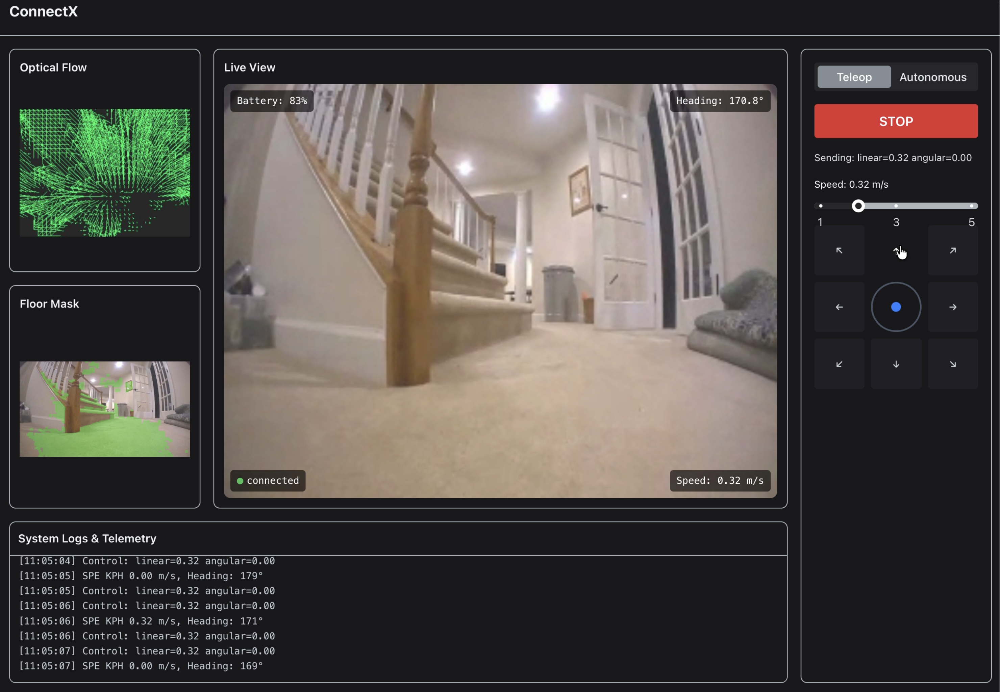

# ConnectX

**Hardware Abstraction for Embodied AI**

ConnectX is a modular control runtime that separates robot intelligence from robot hardware.

It:
- Wraps native SDKs
- Streams control over WebRTC
- Provides a unified ROS 2 interface
- Exposes robot capabilities via MCP to LLM agents or planners

**The result:** portable autonomy, interchangeable hardware, and agent-driven control.

ConnectX is for development and research. Use in a safe environment; it is not intended for safety-critical or unsupervised operation.



[](https://github.com/codespaces/new?hide_repo_select=true&ref=main&repo=vselvarajijay/connectX&machine=basicLinux32gb&location=EastUs)

---

## Requirements

- **Docker** and **Docker Compose** — Used for the app, bridge, SDK, TURN server, and perception services.
- **pnpm** — For building the React app (`app/www`). Install from [pnpm.io](https://pnpm.io) or your package manager.
- **Python 3.10+** — For local scripts (e.g. `scripts/download_models.py`).

---

## Quick Start

```bash
# Copy env and set ROBOT_TYPE + any API keys for your robot (see .env.example)
cp .env.example .env

# Build Docker images (run once after clone or when deps change)
./cli.sh build

# Start the bridge and open a dev shell
./cli.sh start

# Stop the bridge
./cli.sh stop
```

Once running, open `http://localhost:8000` to access the live view interface:

- **Live video feed** — Real-time camera stream from the robot
- **Robot controls** — Drive with keyboard or on-screen controls
- **Telemetry dashboard** — Battery, speed, heading, and signal strength
- **Perception panels** — Optical flow and floor mask overlays

---

## ROS 2 CI (run tests locally)

To run the same build and test as GitHub Actions (e.g. before pushing):

```bash
./scripts/run_ros2_ci_local.sh
```

The script mounts the repo and overlays **empty volumes** on `ros2_ws/build`, `ros2_ws/install`, and `ros2_ws/log`, so the container never sees stale paths (e.g. `/root/workspace/ros2_ws`) and you avoid CMake/colcon path mismatches. If you run `docker run` yourself, include those same volume args; see `scripts/run_ros2_ci_local.sh` for the exact command.

---

## Perception

Run `python3 scripts/download_models.py` once to download models, then `./cli.sh start` — perception runs automatically. Use `./scripts/test_perception.sh` to verify everything is working.

> **Note (Mac):** Relays use `APP_URL=http://host.docker.internal:8000`. On Linux, set `APP_URL=http://127.0.0.1:8000` in `.env` if needed.

---

## Adding a New Robot

**Currently supported:** `earth_rovers_sdk` (Earth Rovers). Set `ROBOT_TYPE=earth_rovers_sdk` in `.env` and configure the relevant variables in `.env.example`. To add another robot type:

### 1. Implement `RobotBase`

```python
# ros2_ws/src/connectx_robot_bridge/connectx_robot_bridge/robots/my_robot.py
from connectx_robot_bridge.core.robot_base import RobotBase
from connectx_robot_bridge.core.models.telemetry import TelemetryFrame

class MyRobot(RobotBase):
    def __init__(self): ...
    def move_forward(self): ...
    def move_backward(self): ...
    def move_left(self): ...
    def move_right(self): ...
    def stop(self): ...
    def get_front_camera_frame(self): ...  # return bytes or None
    def get_telemetry(self) -> TelemetryFrame: ...  # return TelemetryFrame or None
```

Optional overrides: `send_velocity(linear, angular)` for continuous control, `set_lamp(lamp)` if supported.

### 2. Register in the factory

```python
# connectx_robot_bridge/core/robot_factory.py
elif robot_type == "my_robot":
    return MyRobot()
```

### 3. Configure `.env`

```bash
ROBOT_TYPE=my_robot
MY_ROBOT_API_KEY=your_api_key_here
```

Copy `.env.example` to `.env` to see all available options.

---

## Debugging

For troubleshooting (joystick/controls, bridge logs, WebSocket vs WebRTC, env), see **[Debugging](docs/docs/debugging.md)** in the docs.

---

## Contributing

See [CONTRIBUTING.md](CONTRIBUTING.md) for full setup, development workflow, and how to submit changes.

---

## License

Apache 2.0 — see [LICENSE](LICENSE).
