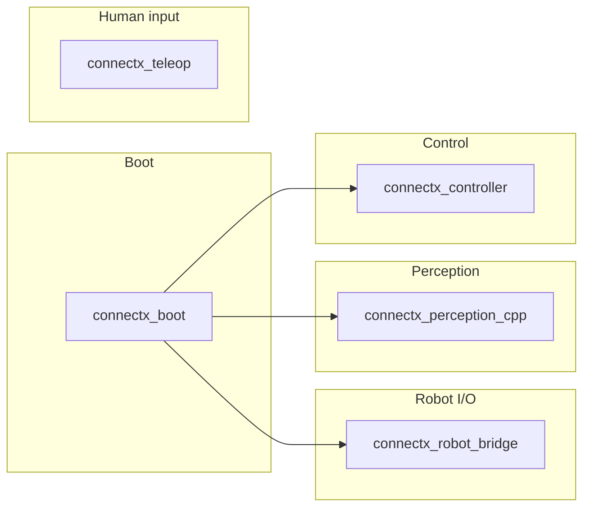

# ConnectX

**Write once, run on any robot.** ConnectX lets you build ROS 2 control systems that work across different robot hardware without rewriting code for each platform. Connect any robot's native SDK over WebRTC, and your autonomy stack stays hardware-agnostic.

---

## Quick Start

### Build and Run

```bash
# Build Docker images and the ROS 2 workspace (run once after clone or when deps change)
./cli.sh build

# Start the bridge and open a dev shell
./cli.sh start

# Stop the bridge
./cli.sh stop
```


### WebRTC Live View

Once configured, you can access the WebRTC live view interface in your browser at `http://localhost:8000`. The interface provides:

- **Live video feed** - Real-time camera stream from the robot
- **Robot controls** - Drive the robot with keyboard or on-screen controls
- **Telemetry dashboard** - Monitor battery, speed, heading, and signal strength
- **Connection status** - WebRTC signaling and data channel status
- **Perception panels** - Optical flow and floor mask (when scout_perception and relays are running)


### Perception in the UI

The right-side panels show **optical flow** (vector arrows) and **floor mask** (floor detection overlay) from the perception stack. Relays subscribe to ROS2 topics and POST frames to the app so the UI can display them.

1. **Run once:** `python3 scripts/download_models.py` (downloads Mask2Former for floor mask).
2. **Start:** `./cli.sh start` — scout_perception runs optical_flow_node, floor_mask_node, and their relays automatically.
3. **Test:** `./scripts/test_perception.sh` — checks container status, app reachability, ROS topic rates, and perception APIs.

On Docker Desktop for Mac, relays use `APP_URL=http://host.docker.internal:8000` to reach the app. On Linux you can set `APP_URL=http://127.0.0.1:8000` in `.env` if needed. If APIs return 503, check `docker compose --profile webrtc logs scout_perception` and ensure `/camera/front/compressed` is publishing (bridge + robot/SDK).

---

## ROS 2 Architecture

The ROS 2 workspace is organized into five packages. The boot package launches perception and control; the others provide robot I/O, teleop, perception, and control logic.

<!-- View on GitHub or any Mermaid-capable Markdown viewer to see the diagram rendered. -->



### Package roles

| Package | Role |
|--------|------|
| **connectx_boot** | Launch only. Starts the default stack: `floor_mask_node`, `optical_flow_node`, and `wander_node`. Depends on controller, perception, and bridge for topic compatibility. |
| **connectx_robot_bridge** | ROS 2 ↔ robot SDK. Subscribes to `/cmd_vel` and `/robot/lamp`; publishes `/camera/front/compressed` and `/robot/telemetry`. Converts Twist to robot velocity, forwards lamp state, and pulls camera and telemetry from the robot. |
| **connectx_teleop** | Human input. **keyboard_node** publishes target velocity to `/teleop/velocity_target`. **webrtc_node** streams camera over WebRTC, receives drive/lamp/autonomy from the app, and publishes to `/cmd_vel`, `/robot/lamp`, and `/autonomy/command`. |
| **connectx_perception_cpp** | Vision (C++). **floor_mask_node** turns `/camera/front/compressed` into a floor mask on `/perception/floor_mask`. **optical_flow_node** uses camera (and optional mask) and publishes `/optical_flow`. |
| **connectx_controller** | Velocity and autonomy. **controller_node** runs high-level commands from `/autonomy/command` using `/robot/telemetry`, publishes `/cmd_vel`. **manual_controller** ramps and limits `/teleop/velocity_target` into `/cmd_vel`. **wander_node** does optical-flow-based wandering from `/optical_flow` and `/autonomy/command`, publishes `/cmd_vel`. |

---

## Configuring a Robot

To add support for a new robot, you need to:

1. **Implement the `RobotBase` class**
2. **Configure environment variables** in `.env`

### Step 1: Implement RobotBase

Create a new robot class that inherits from `RobotBase` and implements all abstract methods:

```python
# ros2_ws/src/connectx_robot_bridge/connectx_robot_bridge/robots/my_robot.py

from connectx_robot_bridge.core.robot_base import RobotBase
from connectx_robot_bridge.core.models.telemetry import TelemetryFrame

class MyRobot(RobotBase):
    """Robot implementation for MyRobot SDK."""
    
    def __init__(self):
        # Initialize your robot SDK here
        pass
    
    def move_forward(self) -> None:
        # Send forward command to robot
        pass
    
    def move_backward(self) -> None:
        # Send backward command to robot
        pass
    
    def move_left(self) -> None:
        # Send left turn command to robot
        pass
    
    def move_right(self) -> None:
        # Send right turn command to robot
        pass
    
    def stop(self) -> None:
        # Send stop command to robot
        pass
    
    def get_front_camera_frame(self):
        # Return latest camera frame as bytes, or None if unavailable
        return None
    
    def get_telemetry(self) -> TelemetryFrame:
        # Return latest telemetry data, or None if unavailable
        return None
```

**Required methods:**
- `move_forward()`, `move_backward()`, `move_left()`, `move_right()`, `stop()` - Control robot movement
- `get_front_camera_frame()` - Return camera frame as bytes (or `None`)
- `get_telemetry()` - Return `TelemetryFrame` with sensor data (or `None`)

**Optional methods:**
- `send_velocity(linear, angular)` - Override for continuous velocity control (default converts to discrete commands)
- `set_lamp(lamp)` - Override if robot supports lamps

### Step 2: Register Your Robot

Add your robot to the factory:

```python
# ros2_ws/src/connectx_robot_bridge/connectx_robot_bridge/core/robot_factory.py

from connectx_robot_bridge.robots.my_robot import MyRobot

def create_robot(robot_type: str) -> Optional[RobotBase]:
    if robot_type == "earth_rovers_sdk":
        return EarthRoversRobot()
    elif robot_type == "my_robot":  # Add your robot type
        return MyRobot()
    return None
```

### Step 3: Configure .env

Copy `.env.example` to `.env` and set your robot configuration:

```bash
# Select which robot SDK to use
ROBOT_TYPE=my_robot

# Add your robot-specific environment variables
MY_ROBOT_API_KEY=your_api_key_here
MY_ROBOT_HOST=192.168.1.100
```

ConnectX reads `ROBOT_TYPE` from `.env` and creates the corresponding robot instance. Any other environment variables your robot needs can be added to `.env` and accessed via `os.getenv()` in your robot class.

**Example:** For the Earth Rovers robot, the `.env` file includes:
- `ROBOT_TYPE=earth_rovers_sdk`
- `FRODOBOT_SDK_API_TOKEN` - API token for authentication
- `FRODOBOT_BOT_SLUG` - Robot identifier
- `FRODOBOT_MISSION_SLUG` - Mission identifier
- `FRODOBOT_CHROME_EXECUTABLE_PATH` - Path to Chrome (for camera capture)

See `.env.example` for the full list of available configuration options.

