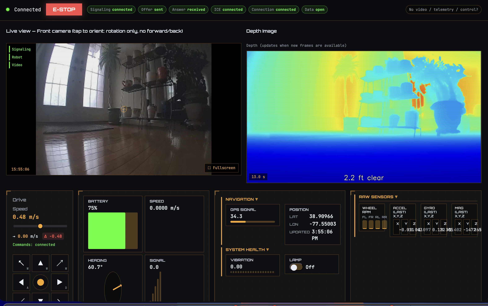

# Bunny

**Write once, run on any robot.** Bunny lets you build ROS 2 control systems that work across different robot hardware without rewriting code for each platform. Connect any robot's native SDK over WebRTC, and your autonomy stack stays hardware-agnostic.

---

## Quick Start

### Prerequisites

- **Docker** and **Docker Compose**
- **macOS only**: [XQuartz](https://www.xquartz.org/) for GUI support (RViz, etc.)
  - Open XQuartz → **Preferences → Security**
  - Enable **"Allow connections from network clients"**
  - Restart XQuartz after changing this setting

### Build and Run

```bash
# Build Docker images and the ROS 2 workspace (run once after clone or when deps change)
./cli.sh build

# Start the bridge and open a dev shell
./cli.sh start

# Stop the bridge
./cli.sh stop
```

### Test Robot Control

```bash
# In the dev shell, run teleop with arrow keys
ros2 run bunny_robot_bridge teleop_node
```

Use **Up** (forward), **Down** (back), **Left** / **Right** (turn). Ctrl+C to quit.

### WebRTC Live View

Once configured, you can access the WebRTC live view interface in your browser at `http://localhost:8000`. The interface provides:

- **Live video feed** - Real-time camera stream from the robot
- **Robot controls** - Drive the robot with keyboard or on-screen controls
- **Telemetry dashboard** - Monitor battery, speed, heading, and signal strength
- **Connection status** - WebRTC signaling and data channel status
- **Depth image** - Depth estimation (right panel), when perception and the depth relay are running



### Depth in the UI

The depth panel (right side) shows depth estimation from the `da3_node`. The **depth relay** subscribes to ROS2 `/da3/depth_colored` and POSTs frames to the app so the UI can display them.

1. **Run once:** `python3 scripts/download_models.py` (creates `models/DA3Metric-Large`).
2. **Start:** `./cli.sh start` — scout_perception runs the relay and da3_node automatically.
3. **Test:** `./scripts/test_perception.sh` — checks container status, app reachability from the relay, ROS topic rates, and the depth API.

On Docker Desktop for Mac, the relay uses `APP_URL=http://host.docker.internal:8000` so it can reach the app. On Linux you can set `APP_URL=http://127.0.0.1:8000` in `.env` if needed. If depth stays 503, check `docker compose --profile webrtc logs scout_perception` and ensure `/camera/front/compressed` is publishing (bridge + robot/SDK).

Depth updates when new frames arrive; it is slower than the live video feed.

---

## Configuring a Robot

To add support for a new robot, you need to:

1. **Implement the `RobotBase` class**
2. **Configure environment variables** in `.env`

### Step 1: Implement RobotBase

Create a new robot class that inherits from `RobotBase` and implements all abstract methods:

```python
# ros2_ws/src/bunny_robot_bridge/bunny_robot_bridge/robots/my_robot.py

from bunny_robot_bridge.core.robot_base import RobotBase
from bunny_robot_bridge.core.models.telemetry import TelemetryFrame

class MyRobot(RobotBase):
    """Robot implementation for MyRobot SDK."""
    
    def __init__(self):
        # Initialize your robot SDK here
        pass
    
    def move_forward(self) -> None:
        # Send forward command to robot
        pass
    
    def move_backward(self) -> None:
        # Send backward command to robot
        pass
    
    def move_left(self) -> None:
        # Send left turn command to robot
        pass
    
    def move_right(self) -> None:
        # Send right turn command to robot
        pass
    
    def stop(self) -> None:
        # Send stop command to robot
        pass
    
    def get_front_camera_frame(self):
        # Return latest camera frame as bytes, or None if unavailable
        return None
    
    def get_telemetry(self) -> TelemetryFrame:
        # Return latest telemetry data, or None if unavailable
        return None
```

**Required methods:**
- `move_forward()`, `move_backward()`, `move_left()`, `move_right()`, `stop()` - Control robot movement
- `get_front_camera_frame()` - Return camera frame as bytes (or `None`)
- `get_telemetry()` - Return `TelemetryFrame` with sensor data (or `None`)

**Optional methods:**
- `send_velocity(linear, angular)` - Override for continuous velocity control (default converts to discrete commands)
- `set_lamp(lamp)` - Override if robot supports lamps

### Step 2: Register Your Robot

Add your robot to the factory:

```python
# ros2_ws/src/bunny_robot_bridge/bunny_robot_bridge/core/robot_factory.py

from bunny_robot_bridge.robots.my_robot import MyRobot

def create_robot(robot_type: str) -> Optional[RobotBase]:
    if robot_type == "earth_rovers_sdk":
        return EarthRoversRobot()
    elif robot_type == "my_robot":  # Add your robot type
        return MyRobot()
    return None
```

### Step 3: Configure .env

Copy `.env.example` to `.env` and set your robot configuration:

```bash
# Select which robot SDK to use
ROBOT_TYPE=my_robot

# Add your robot-specific environment variables
MY_ROBOT_API_KEY=your_api_key_here
MY_ROBOT_HOST=192.168.1.100
```

Bunny reads `ROBOT_TYPE` from `.env` and creates the corresponding robot instance. Any other environment variables your robot needs can be added to `.env` and accessed via `os.getenv()` in your robot class.

**Example:** For the Earth Rovers robot, the `.env` file includes:
- `ROBOT_TYPE=earth_rovers_sdk`
- `FRODOBOT_SDK_API_TOKEN` - API token for authentication
- `FRODOBOT_BOT_SLUG` - Robot identifier
- `FRODOBOT_MISSION_SLUG` - Mission identifier
- `FRODOBOT_CHROME_EXECUTABLE_PATH` - Path to Chrome (for camera capture)

See `.env.example` for the full list of available configuration options.

---

## Architecture

```
Robot SDK (native) ←→ WebRTC ←→ Bridge ←→ ROS 2 (your control logic)
```

Bunny handles:
- **Protocol translation** between robot SDK and ROS 2
- **Message standardization** across different platforms
- **Robot-specific configuration** management
- **Real-time WebRTC communication**

### Current Status

Bunny is in early development. Currently implemented:

- ✅ **Robot control** - Send movement commands via ROS 2 `/cmd_vel` topic
- ✅ **Camera streaming** - Front camera published to `/camera/front/compressed`
- ✅ **Telemetry** - Robot sensor data published to `/robot/telemetry`
- ✅ **WebRTC live view** - Stream camera to browser with real-time control

### Future Modules

Planned features (not yet implemented):

- 🔲 **Localization** - Robot position tracking and mapping
- 🔲 **Perception** - Object detection, obstacle avoidance
- 🔲 **Navigation** - Path planning and autonomous navigation
- 🔲 **Multi-robot support** - Coordinate multiple robots

---

## Example: Earth Rovers Robot

The `EarthRoversRobot` class demonstrates a complete implementation:

- **Location:** `ros2_ws/src/bunny_robot_bridge/bunny_robot_bridge/robots/earth_rovers_robot.py`
- **SDK:** Uses Earth Rovers SDK via RTM (Real-Time Messaging) client
- **Configuration:** Set `ROBOT_TYPE=earth_rovers_sdk` in `.env` with required credentials

See the implementation for reference when adding your own robot.

---

## Development

### Project Structure

```
ros2_ws/src/bunny_robot_bridge/
├── bunny_robot_bridge/
│   ├── core/
│   │   ├── robot_base.py      # Abstract base class
│   │   ├── robot_factory.py   # Robot creation
│   │   └── config_manager.py  # Configuration handling
│   ├── robots/
│   │   └── earth_rovers_robot.py  # Example implementation
│   └── nodes/
│       └── bridge_node.py     # Main ROS 2 node
```

### Building

```bash
./cli.sh build
```

### Running

```bash
./cli.sh start
```

This starts:
- **scout_bridge** - Main bridge node (robot control and camera)
- **scout_shell** - Development shell with ROS 2 environment

---

## Troubleshooting

**Robot commands don't work:**
- Check `.env` file has correct `ROBOT_TYPE` and required credentials
- Verify robot SDK is running and accessible
- Check bridge logs: `docker compose logs -f scout_bridge`

**Camera not showing:**
- Ensure robot SDK provides camera endpoint
- Check camera is enabled in robot configuration
- Verify `/camera/front/compressed` topic is publishing: `ros2 topic echo /camera/front/compressed`
